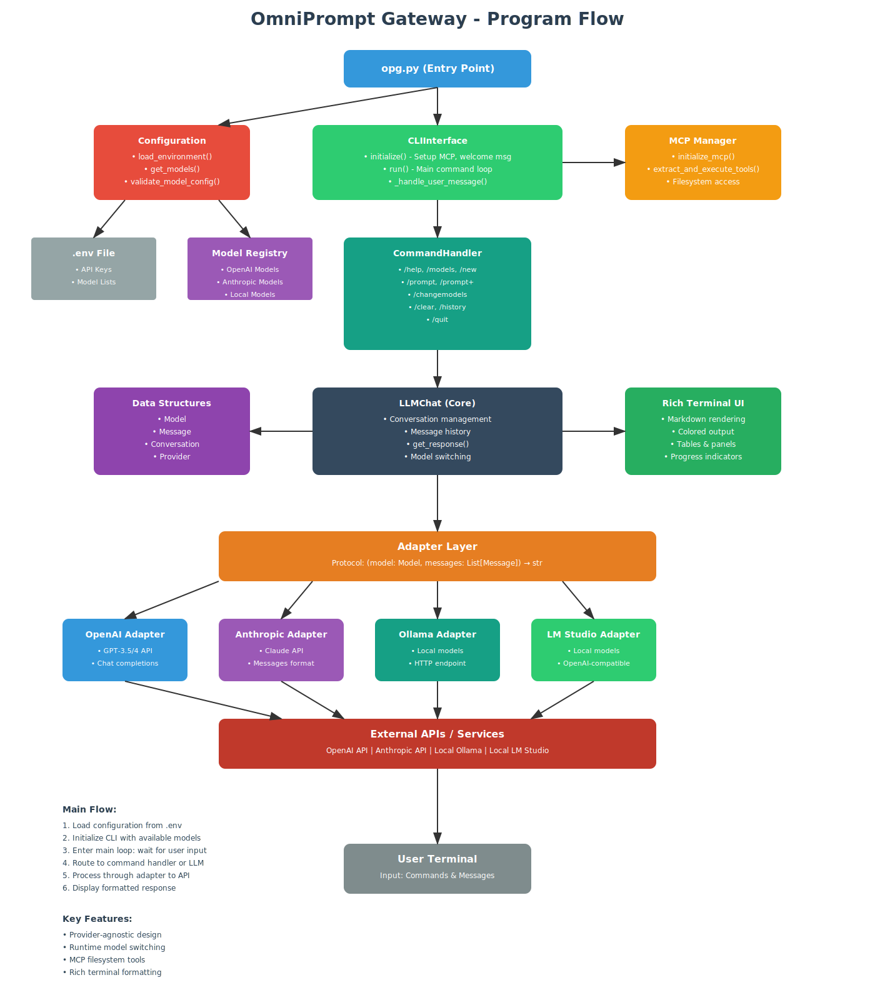

# OmniPrompt Gateway (OPG)

Lightweight Python CLI for multi-model LLM interactions. Supports OpenAI, Anthropic, Ollama, and LM Studio APIs with MCP filesystem tools. Single executable deployment with no dependencies.

## Quick Start

1. Clone the repository
2. Install dependencies: `pip install -r requirements.txt`
3. Copy `.env.example` to `.env` and add your API keys
4. Run: `python opg.py`

## Features

- Multiple LLM support: OpenAI GPT-4/3.5, Anthropic Claude, Ollama, LM Studio
- Provider-based configuration with dynamic model management
- Runtime model selection via `/changemodels` command
- Model Context Protocol (MCP) integration for filesystem access
- Rich terminal UI with markdown rendering
- Seamless model switching within conversations
- System prompt customization per provider
- Lightweight design with minimal dependencies

## Commands

- `/help` - Show all commands
- `/models` - List available models  
- `/new [model]` - Start new conversation
- `/clear` - Clear current conversation
- `/prompt [text]` - Set system prompt for current conversation
- `/prompt+` - Set multi-line system prompt (end with 'END')
- `/setdefault [text]` - Set default system prompt for new conversations
- `/setdefault+` - Set multi-line default prompt (end with 'END')
- `/loadprompt [file]` - Load system prompt from a text file
- `/showprompt` - Show current system prompt
- `/changemodels` - Change available models for any provider
- `/api` - Switch between Chat Completions and Responses API (OpenAI only)
- `/quit` - Exit

## API Switching (OpenAI)

OPG supports both OpenAI API types:

- **Chat Completions API** (default): Traditional stateless API where you manage conversation history
- **Responses API**: New stateful API where OpenAI maintains conversation context server-side

Use the `/api` command while in an OpenAI conversation to switch between them. Each switch creates a new conversation.

### Responses API Benefits:
- Server-side conversation memory
- Simplified API calls (only send new messages)
- Built-in tools support (web search, code interpreter) - coming soon

### Chat Completions API Benefits:
- Full control over conversation history
- Compatible with local models (LM Studio)
- Traditional request/response model

## Configuration

OPG uses a provider-based configuration system. Each provider (OpenAI, Anthropic, local-lmstudio, local-ollama) has its own settings.

Edit `.env` file:

```bash
# OpenAI Configuration
OPENAI_API_KEY=your-key-here
OPENAI_MODELS=gpt-3.5-turbo,gpt-4,gpt-4o
OPENAI_SYSTEM_PROMPT=You are a helpful AI assistant.
OPENAI_TEMPERATURE=0.7
OPENAI_MAX_TOKENS=4096

# Anthropic Configuration
ANTHROPIC_API_KEY=your-key-here
ANTHROPIC_MODELS=claude-3-sonnet-20240229,claude-3-opus-20240229
ANTHROPIC_SYSTEM_PROMPT=You are Claude, a helpful AI assistant.
ANTHROPIC_TEMPERATURE=0.7
ANTHROPIC_MAX_TOKENS=4096

# Local Models (auto-detected)
LOCAL_LMSTUDIO_MODELS=model-name-from-lmstudio
LOCAL_OLLAMA_MODELS=llama2,mistral

# Optional: MCP filesystem access
ENABLE_MCP=true
MCP_FILESYSTEM_PATH=C:/safe/directory
```

### Dynamic Model Management

You can change available models at runtime using the `/changemodels` command:

1. Run `/changemodels`
2. Select a provider (1-4)
3. Enter comma-separated model IDs
4. Changes persist for the current session

To make changes permanent, update the `[PROVIDER]_MODELS` values in your `.env` file.

### .env File Location

OPG looks for `.env` in two places (in order):
1. **Current working directory** - where you run the command from
2. **Next to the executable** - same folder as `opg.exe` or `opg.py`

This allows flexible usage:
- **Portable**: Keep `.env` with `opg.exe` for consistent settings
- **Project-specific**: Put different `.env` files in different project folders
- **Multiple configs**: Run OPG from different directories to use different API keys or settings

## Requirements

- Python 3.8+ (development only)
- Node.js (optional, for MCP features)
- No runtime dependencies for standalone executable

## System Abstractions



## License

MIT
